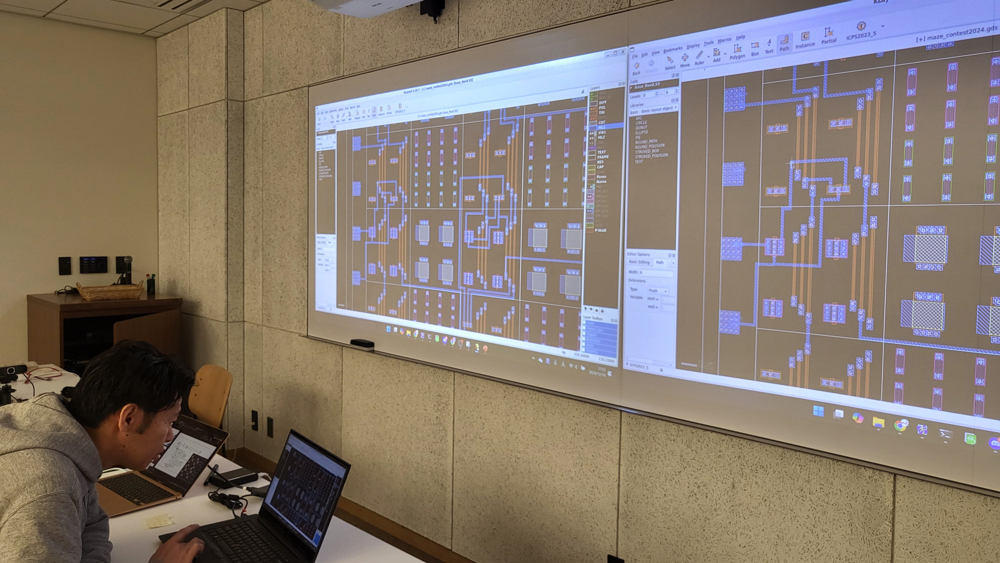
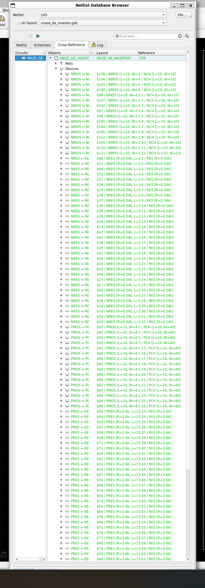

## ミニマルファブコンテスト2024の第一部への投稿作品
公式より、「ゲーム感覚で楽しんでほしい」という旨の発言があったため、まさにゲーム化してみるというチャレンジを行った。

  
  

### 例題
- これが作るインバータのサンプルである。
    -   

    
    
    
    

## 参加者
- 参加者は4名で下記の方々となる。

### FET対応リスト
- 1番手：アイバ
    - P-FET：4番
    - N-FET：6番
- 2番手：松井爽斗
    - P-FET：6番
    - N-FET：4番
- 3番手：安藤陸
    - P-FET：1番
    - N-FET：8番
- 4番手：匿名希望
    - P-FET：5番
    - N-FET：3番

  

### プレイ風景
  
  
  
  

### 結果
#### 回路図
  

#### レイアウト
  

#### LVS
  
  

#### DRC
  
  

### 提出物
- [maze_de_inverter 回路図](maze_de_inverter/maze_de_inverter.sch)
- [maze_de_inverter レイアウト](maze_de_inverter/maze_de_inverter.gds)

### なぜ、この作品なのか？
オープンソース半導体でも「Make:ムーブメント（オープンハードウェア）」レベルのビックウェーブを起こすためである。  
昔の家電メーカーしかPCB基板作れなかった時代に、今のMake:でよく作られているようなLチカをするだけのようなPCB基板の製造は許されなかった。しかし、Make:の世界が現出したことで、PCB基板が民主化し、どのようなPCB基板でも作成できる世界がやってきた。それが半導体の世界にもやってきたことを示すために半導体の民主化の象徴としてこの作品を作成した。  
さらにこの流れが進めば、近いうちに半導体と全くかかわりがない企業が半導体を絡めた事業を展開するのではないかと考えている。 Make:時代に立ち上がった企業も、ハードウェアとは無縁のソフトウェア企業などの中から「社内Make:開発部」みたいなのが立ち上がり、そこから派生したわけである。そして、その人たちが「どこで知識を身に着けてきたか？」を考えるとMake:の流れの中にあるオープンハードウェアからなわけで、ここで「ある程度まとまった数の技術者が生まれた」から、ハードウェアを絡めた事業がどこの会社でも出来るようになったと考えている。  
ここで重要なことは「事業として成功させる」には「参入したい側の業界・業務知識と半導体業界の業界・業務知識の両方を持った仲介者」が必要という点である。よくある失敗として、参入したい側が「半導体業界人を採用して、その人を中心に事業を起こす」というパターンである。この場合、半導体業界人が参入したい企業側の業界・業務知識がないため、「半導体業界ではこうである」というべき論を振りかざして進めて、参入したい側の業界・業務慣習などとあわずにチームが崩壊してしままったり、的外れな製品を作ってしまうというようなパターンである。  
  
そこで、ISHI会は、そういう仲介が出来るような「両方の業界・業務知識」を持った人を育てるため、情報学部の学生や全く知識ゼロのソフトウェアやハードウェア（Web、FPGA、IoTなど）技術者を対象として「とりあえず、半導体系のツールを触ってみてもらう」のを目的として実施したものである。これは、Make:で活躍しているような人も、最初は「初めてKiCADを触ってみるイベント」的なところから始めたという人をよく聞くので、それを参考にした作品である。  
